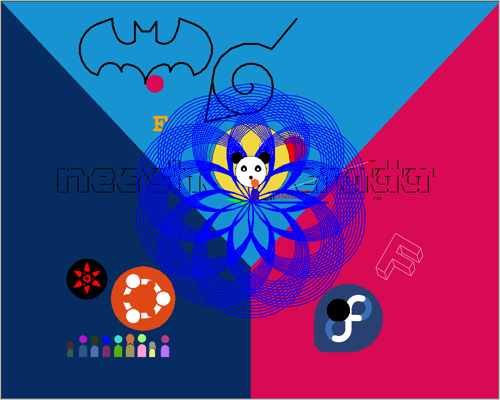

# place.git

This repo was the canvas code for place.git during FOSSMeet'23. The final canvas was the following.

A special shoutout to everyone that participated. The original README shown below.

---

Kinda like r/place, but with git. Fork this repo, add your python turtle code and make a PR. We'll see where we end up!

We have a 1280x1024 [canvas](https://place.fossmeet.net) where you can draw anything your heart desires.

## Points to note

- Add as many lines as you want. Anywhere you want. Don't edit or remove existing lines.
- The program needs to be running once you're done with your changes. And no infinite loops or long-running functions.
- Don't import any libraries other than the already imported ones.
- Use any turtle method you want!
- Don't edit more than 10,000 pixels per commit.
- Don't use the `done()` function or any of the other halt functionss. 
  - you can use it to see the canvas in your own machine, but don't commit it finally.
- Have fun!

## Raising Issues
If you have any other suggestions or would like to remove a line or import a library, raise an issue on this repository and we'll be promptly responding.
